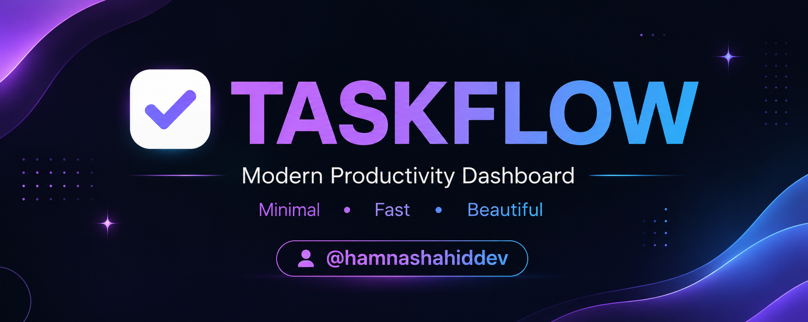
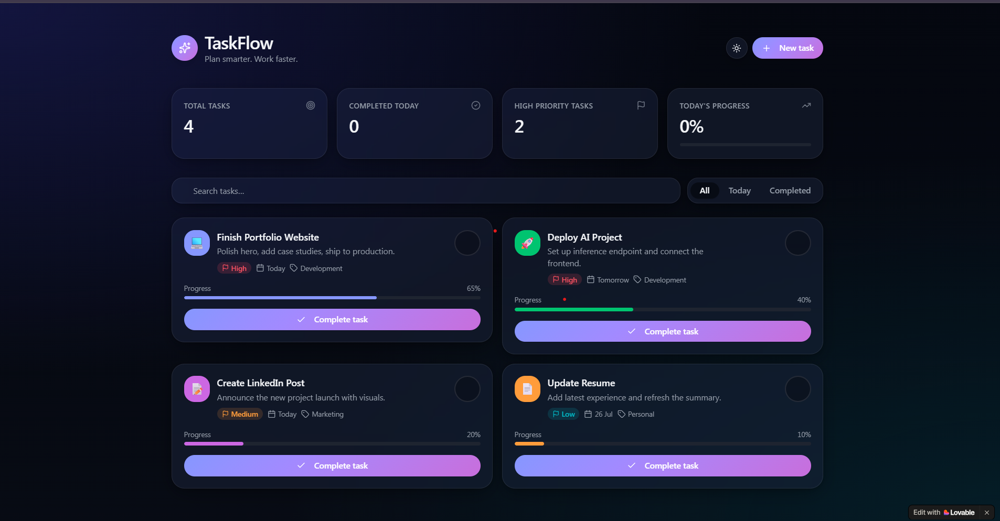
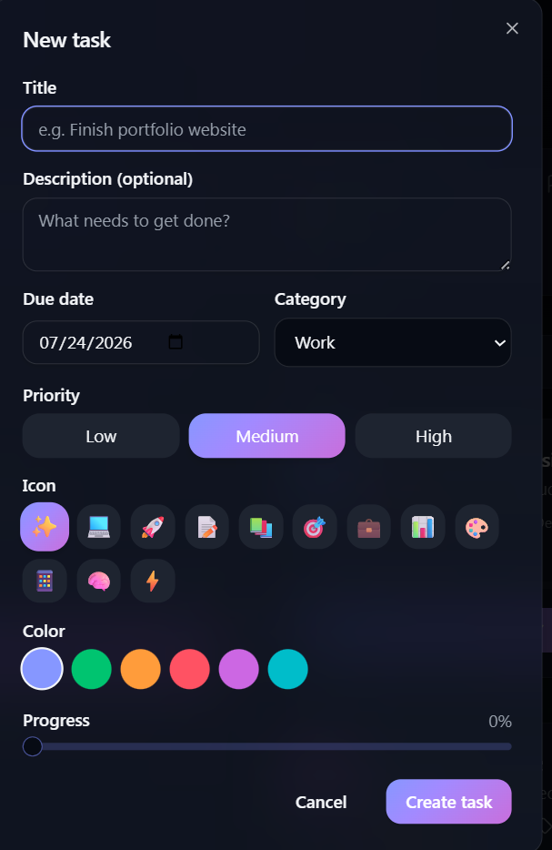
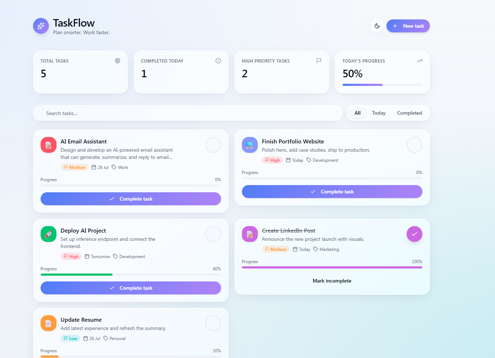
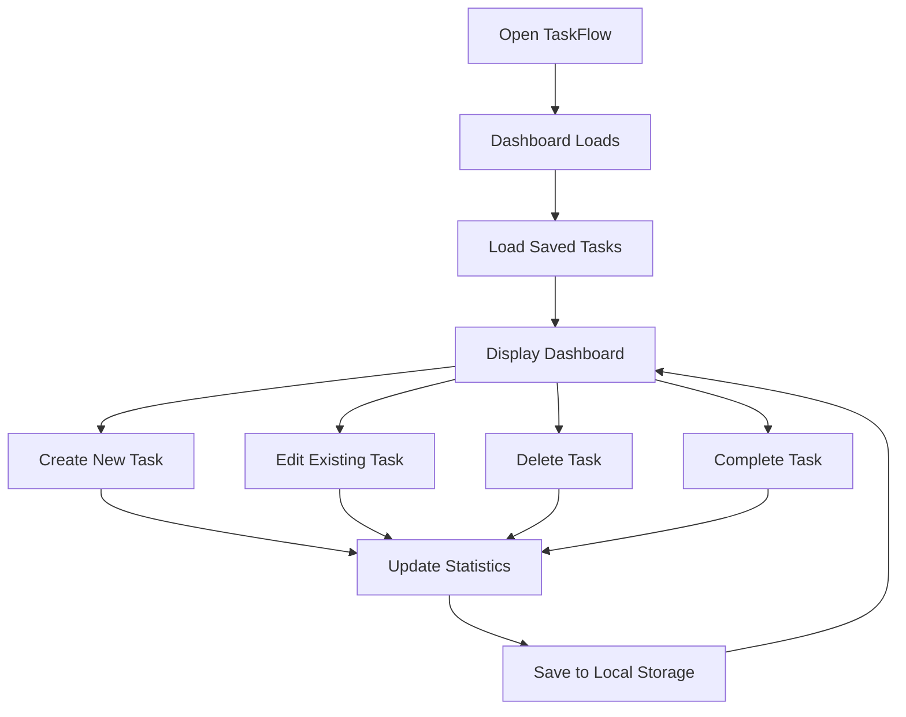

<!-- PROJECT LOGO -->

<h1 align="center">🚀 TaskFlow</h1>
<p align="center">
  
</p>

---

<h3 align="center">TaskFlow</h3>

---


<p align="center">
A modern productivity dashboard built to help you organize tasks, stay focused, and work smarter.
</p>

<p align="center">


</p>

---

<p align="center">

<a href="#demo">🎥 View Demo</a>
•
<a href="https://github.com/hamnashahiddev/TASKFLOW-MODERN-PRODUCTIVITY-DASHBOARD/issues">🐞 Report Bug</a>
•
<a href="https://github.com/hamnashahiddev/TASKFLOW-MODERN-PRODUCTIVITY-DASHBOARD/issues">💡 Request Feature</a>

</p>

---

# 📖 Table of Contents

- [About The Project](#-about-the-project)
- [Why TaskFlow?](#-why-taskflow)
- [Problem Statement](#-problem-statement)
- [Solution](#-solution)
- [Key Features](#-key-features)
- [Dashboard Preview](#-dashboard-preview)
- [Screenshots](#-screenshots)
- [Demo](#-demo)
- [Built With](#-built-with)
- [Getting Started](#-getting-started)
- [Project Structure](#-project-structure)
- [Architecture](#-architecture)
- [Roadmap](#-roadmap)
- [Contributing](#-contributing)
- [License](#-license)
- [Contact](#-contact)
- [Acknowledgments](#-acknowledgments)

---

# 📖 About The Project

TaskFlow is a modern productivity dashboard designed to simplify the way people organize their daily work.

Instead of overwhelming users with unnecessary menus, complex navigation, and feature overload, TaskFlow focuses on what truly matters:

> **Helping users complete their work with clarity, speed, and focus.**

Built using modern frontend technologies and designed with a premium SaaS-inspired interface, TaskFlow combines clean design with practical functionality.

Whether you're managing personal goals, software projects, study sessions, or daily routines, TaskFlow provides an intuitive workspace that keeps productivity simple.

The application demonstrates how thoughtful design and user experience can transform even the most common productivity tools into something enjoyable to use.

---

# 🚀 Why TaskFlow?

Today's productivity tools often become productivity obstacles.

Instead of helping users focus, they introduce unnecessary complexity.

TaskFlow was created around a different philosophy.

### Less clutter.

### Less distraction.

### More focus.

### More progress.

Every component, animation, layout decision, and interaction was intentionally designed to create an experience that feels calm, responsive, and enjoyable.

Rather than becoming another "all-in-one workspace," TaskFlow aims to become a workspace people actually enjoy opening every day.

---

# ❗ Problem Statement

Modern productivity applications often suffer from one common issue:

They attempt to solve every possible problem.

As a result, users are forced to navigate through:

- Endless menus
- Complex dashboards
- Multiple workspaces
- Confusing settings
- Feature overload
- Steep learning curves

Eventually, people spend more time managing the tool than completing their work.

The experience becomes overwhelming instead of productive.

---

# 💡 Solution

TaskFlow approaches productivity differently.

The application removes unnecessary complexity and focuses on providing an experience that feels effortless.

TaskFlow enables users to:

- Organize daily tasks
- Track productivity
- Manage priorities
- Visualize progress
- Stay focused
- Complete work faster

Everything is presented through a clean interface that minimizes distractions while maximizing usability.

---

# ✨ Key Features

## 📋 Smart Task Management

Create, edit, update, and organize daily tasks with ease.

---

## 🎯 Priority Levels

Organize work using:

- 🔴 High Priority
- 🟡 Medium Priority
- 🟢 Low Priority

---

## 📊 Productivity Dashboard

Instantly monitor:

- Total Tasks
- Completed Tasks
- Pending Tasks
- High Priority Tasks
- Daily Progress

---

## 📈 Progress Tracking

Visual progress indicators help users understand how much work has been completed throughout the day.

---

## 🔍 Smart Search

Quickly locate tasks using real-time search functionality.

---

## 📂 Task Categories

Organize tasks into different categories for better productivity.

Examples include:

- Development
- Learning
- Personal
- Marketing
- Design
- Business

---

## 🌙 Dark Mode

Modern dark theme designed for comfortable daily use.

---

## 📱 Responsive Design

Optimized for:

- Desktop
- Laptop
- Tablet
- Mobile

---

## ⚡ High Performance

Built with modern frontend technologies for:

- Fast loading
- Smooth animations
- Lightweight performance
- Excellent user experience

---

## 💾 Local Storage

TaskFlow stores all task information directly inside the browser.

Benefits include:

- No account required
- Instant loading
- Persistent data
- Improved privacy

---

# 🖥 Dashboard Preview

<p align="center">

</p>

The dashboard provides an at-a-glance overview of your daily productivity.

Users can instantly monitor:

- Total Tasks
- Completed Tasks
- High Priority Tasks
- Daily Progress

Everything important is visible within seconds.

---

# 📸 Screenshots

## 📋 Task Management

<p align="center">

</p>

Manage all tasks through an intuitive and distraction-free interface.

---

## 🌙 Dark Mode

<p align="center">

</p>

A modern interface inspired by premium SaaS products.

---

## 📱 Mobile Responsive

<p align="center">

</p>

TaskFlow is fully responsive and optimized for mobile devices.

---

# 🎥 Demo

Watch the complete application walkthrough below.

> 📹 **demo.mp4**

The demo showcases:

- Creating tasks
- Editing tasks
- Completing tasks
- Searching tasks
- Dashboard updates
- Responsive layout
- Smooth user interactions

---

# ⭐ Highlights

✔ Modern SaaS Design

✔ Responsive Layout

✔ Local Storage Support

✔ Dark Mode

✔ Premium UI

✔ Fast Performance

✔ Built with Lovable

✔ React + TypeScript

✔ Vite Powered

✔ Tailwind CSS

✔ Clean Architecture

✔ Easy to Customize

---

> **"Productivity isn't about doing more things. It's about doing the right things with less friction."**
---

# 🛠 Built With

TaskFlow is built using modern frontend technologies to deliver a fast, responsive, and scalable user experience.

<div align="center">

| Technology | Purpose |
|------------|----------|
| ⚛️ React | Component-based UI Development |
| 🔷 TypeScript | Type Safety & Better Developer Experience |
| ⚡ Vite | Lightning-fast Development & Build Tool |
| 🎨 Tailwind CSS | Utility-first Styling |
| ❤️ Lovable | AI-assisted UI Development |
| 📦 Bun | Fast Package Manager |
| 💾 Browser Local Storage | Persistent Client-side Data Storage |
| 🔍 ESLint | Code Quality & Linting |
| 🎯 Prettier | Code Formatting |

</div>

---

# 🏗 Architecture

TaskFlow follows a modern frontend architecture that separates UI components, business logic, utilities, and routing for maintainability and scalability.

---

# 🔄 Application Workflow



---

# 📂 Project Structure

```
TASKFLOW-MODERN-PRODUCTIVITY-DASHBOARD
│
├── public/
│
├── src/
│   ├── components/
│   ├── hooks/
│   ├── routes/
│   ├── styles/
│   ├── utils/
│   ├── App.tsx
│   └── main.tsx
│
├── README.md
├── architecture.md
├── installation.md
├── features.md
├── CONTRIBUTING.md
├── CHANGELOG.md
├── CODE_OF_CONDUCT.md
├── LICENSE
├── package.json
├── vite.config.ts
└── tsconfig.json
```

---

# ⚙ Core Modules

## 📋 Task Manager

Responsible for:

- Creating Tasks
- Editing Tasks
- Deleting Tasks
- Completing Tasks

---

## 📊 Dashboard

Displays real-time statistics including:

- Total Tasks
- Completed Today
- High Priority Tasks
- Overall Progress

---

## 🔍 Search Engine

Allows users to instantly search and filter tasks.

---

## 🎯 Priority Manager

Supports:

- High Priority
- Medium Priority
- Low Priority

---

## 💾 Storage Manager

Stores application data inside browser Local Storage.

No backend required.

No authentication required.

Everything works offline.

---

# 🚀 Getting Started

Follow these steps to run TaskFlow locally.

---

## 📋 Prerequisites

Before getting started, ensure you have installed:

- Node.js (Latest LTS)
- Bun or npm
- Git
- Visual Studio Code

Verify installation:

```bash
node -v
npm -v
git --version
```

---

# 💻 Installation

Clone the repository

```bash
git clone https://github.com/your-username/TASKFLOW-MODERN-PRODUCTIVITY-DASHBOARD.git
```

Move into the project folder

```bash
cd TASKFLOW-MODERN-PRODUCTIVITY-DASHBOARD
```

Install dependencies

Using npm

```bash
npm install
```

or Bun

```bash
bun install
```

---

# ▶ Running the Development Server

Using npm

```bash
npm run dev
```

Using Bun

```bash
bun dev
```

Open your browser

```
http://localhost:5173
```

---

# 📦 Build for Production

Using npm

```bash
npm run build
```

Using Bun

```bash
bun run build
```

---

# 🔍 Preview Production Build

```bash
npm run preview
```

or

```bash
bun preview
```

---

# 📖 Usage Guide

## ➜ Create Task

Click the **New Task** button.

Fill in:

- Title
- Description
- Priority
- Category
- Due Date

Save the task.

---

## ➜ Complete Task

Press the ✔ button.

Dashboard statistics update automatically.

---

## ➜ Search Tasks

Use the search bar to instantly locate any task.

---

## ➜ Filter Tasks

Switch between:

- All
- Active
- Completed

---

## ➜ Track Progress

Watch dashboard analytics update in real time.

---

# 💾 Data Storage Strategy

TaskFlow uses Browser Local Storage.

Advantages:

- Works Offline
- No Login Required
- No Backend
- No Database
- Faster Performance
- Better Privacy

---

# 🎨 UI Design Philosophy

TaskFlow follows modern SaaS design principles.

### Simplicity First

Reduce unnecessary visual clutter.

---

### Consistency

Consistent spacing, typography, colors, and interactions.

---

### Accessibility

Readable fonts.

Comfortable spacing.

Responsive layouts.

---

### Performance

Minimal JavaScript.

Optimized rendering.

Fast loading experience.

---

# ⚡ Performance Optimizations

✔ Component-based architecture

✔ TypeScript safety

✔ Vite bundling

✔ Optimized assets

✔ Lightweight animations

✔ Responsive layout

✔ Local Storage caching

✔ Modular components

✔ Clean folder structure

✔ Scalable codebase

---

# 🔐 Privacy

TaskFlow values user privacy.

The application:

- Does not require sign-up
- Does not collect personal information
- Does not transmit user data
- Stores everything locally
- Gives complete control to the user

---

# 🌍 Browser Compatibility

| Browser | Supported |
|----------|-----------|
| Chrome | ✅ |
| Edge | ✅ |
| Firefox | ✅ |
| Brave | ✅ |
| Safari | ✅ |

---

# 🗺 Roadmap

TaskFlow is actively evolving. Below are some planned improvements and future features.

## 🚀 Version 1.0 (Completed)

- [x] Modern SaaS UI
- [x] Responsive Design
- [x] Task Management
- [x] Priority Levels
- [x] Dashboard Statistics
- [x] Search Tasks
- [x] Progress Tracking
- [x] Local Storage Support
- [x] Dark Theme
- [x] Mobile Responsive Layout

---

## 🚀 Version 2.0

- [ ] Calendar Integration
- [ ] Drag & Drop Tasks
- [ ] Due Date Notifications
- [ ] Daily Productivity Reports
- [ ] Weekly Statistics
- [ ] Recurring Tasks
- [ ] Custom Labels
- [ ] Task Notes
- [ ] Keyboard Shortcuts

---

## 🚀 Version 3.0

- [ ] AI Task Suggestions
- [ ] Smart Priority Recommendations
- [ ] AI Productivity Insights
- [ ] Pomodoro Timer
- [ ] Habit Tracking
- [ ] Goal Tracking
- [ ] Export Tasks (CSV/PDF)
- [ ] Import Existing Tasks
- [ ] Cloud Synchronization

---

## 🚀 Long-Term Vision

TaskFlow aims to become more than a simple task manager.

Future releases will focus on creating an intelligent productivity workspace that helps users plan, organize, and accomplish meaningful work with minimal distractions.

---

# 📈 Performance

TaskFlow is designed with performance as a priority.

### ⚡ Fast Startup

The application loads almost instantly thanks to Vite's optimized build process.

### ⚡ Lightweight

No unnecessary frameworks or heavy libraries.

### ⚡ Responsive

Optimized for:

- Desktop
- Laptop
- Tablet
- Mobile

### ⚡ Efficient Rendering

React components update only when needed, providing a smooth user experience.

---

# 🎨 Design Principles

TaskFlow follows five core design principles.

## 🎯 Simplicity

Keep the interface clean and distraction-free.

---

## ⚡ Speed

Every interaction should feel immediate.

---

## 📱 Accessibility

Comfortable spacing, readable typography, and responsive layouts.

---

## 🧩 Consistency

Consistent colors, spacing, animations, and UI components.

---

## ❤️ User Experience

Every feature exists to help users focus—not overwhelm them.

---

# 📚 Documentation

Additional project documentation can be found below.

| Document | Description |
|----------|-------------|
| 📖 README.md | Project Overview |
| 🏗 architecture.md | Project Architecture |
| ✨ features.md | Feature Documentation |
| ⚙ installation.md | Installation Guide |
| 🤝 CONTRIBUTING.md | Contribution Guidelines |
| 📜 CHANGELOG.md | Version History |
| 📄 CODE_OF_CONDUCT.md | Community Standards |
| 📃 LICENSE | MIT License |

---

# 🤝 Contributing

Contributions are welcome and greatly appreciated.

If you'd like to improve TaskFlow, you can:

- Report bugs
- Suggest new features
- Improve documentation
- Refactor code
- Improve UI
- Optimize performance

### Contribution Workflow

1. Fork the repository

2. Create a feature branch

```bash
git checkout -b feature/NewFeature
```

3. Commit your changes

```bash
git commit -m "Add New Feature"
```

4. Push your branch

```bash
git push origin feature/NewFeature
```

5. Open a Pull Request

Please read **CONTRIBUTING.md** before submitting changes.

---

# 🐞 Reporting Issues

Found a bug?

Please open an Issue and include:

- Operating System
- Browser
- Steps to Reproduce
- Expected Behavior
- Actual Behavior
- Screenshots (if applicable)

This helps improve the project for everyone.

---

# ⭐ Show Your Support

If you found this project helpful:

⭐ Star the repository

🍴 Fork the repository

🛠 Contribute improvements

📢 Share it with others

Every star motivates future development.

---

# 🙏 Acknowledgments

Special thanks to the amazing tools and communities that made this project possible.

- React Team
- TypeScript Team
- Vite
- Tailwind CSS
- Lovable
- GitHub
- Open Source Community

---

# 📜 License

This project is licensed under the MIT License.

See the **LICENSE** file for more information.

---

# 📬 Contact

I'd love to hear your feedback, suggestions, or collaboration ideas.

### 👩‍💻 Hamna Shahid

💼 LinkedIn

https://www.linkedin.com/in/hamna-shahid-a3738a339/

🐙 GitHub

https://github.com/hamnashahiddev

📧 Email

hamnashahid021@gmail.com

---

# ❤️ Connect With Me

If you enjoy projects related to:

- AI Automation
- Productivity Applications
- Modern Web Development
- Frontend Engineering
- No-Code & Low-Code Solutions
- n8n Workflows
- AI Agents

Let's connect and build something amazing together.

---

# 🌟 Future Improvements

Potential upcoming features include:

- AI Task Assistant
- Team Collaboration
- Real-time Synchronization
- Cloud Backup
- Multiple Workspaces
- Themes
- Pomodoro Timer
- Habit Tracker
- Calendar View
- Analytics Dashboard
- Offline Support
- Progressive Web App (PWA)
- Voice Commands
- AI Smart Scheduling

---

# 📊 Project Status

> 🚧 Actively Maintained

TaskFlow is under continuous development.

New features, improvements, and optimizations are planned for future releases.

---

# 💬 Quote

> **"Great products aren't remembered because they have the most features. They're remembered because they solve real problems beautifully."**

---

<div align="center">

## ⭐ If you like this project, consider giving it a star!

It helps others discover the project and motivates future development.

---

Made with ❤️ by **Hamna Shahid**

© 2026 TaskFlow. All Rights Reserved.

</div>